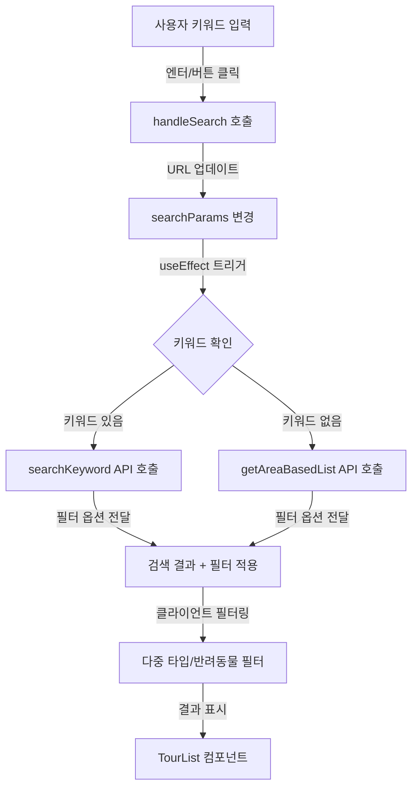

# Phase 2: 검색 기능 구현

## 작업 목표

관광지 목록 페이지에 키워드 검색 기능을 추가합니다. 사용자가 입력한 키워드로 관광지를 검색하고, 검색 결과를 필터와 조합하여 표시할 수 있습니다.

## 현재 상태

- ✅ `lib/api/tour-api.ts`: `searchKeyword()` 함수 구현 완료
- ✅ `components/tour-list.tsx`: 목록 표시 컴포넌트 (검색 결과에도 재사용 가능)
- ✅ `components/tour-filters.tsx`: 필터 컴포넌트 구현 완료
- ✅ `components/tour-page-content.tsx`: 필터 기반 목록 로드 로직 구현 완료
- ❌ `components/tour-search.tsx`: 검색 UI 컴포넌트 미구현
- ❌ `lib/types/filter.ts`: 검색 키워드 필드 없음
- ❌ 검색 + 필터 조합 로직 미구현

## 구현 계획

### 1. 필터 상태 타입 확장

**파일 경로**: `lib/types/filter.ts`

**구현 내용**:

```typescript
export interface FilterState {
  // ... 기존 필드들 ...

  /** 검색 키워드 */
  keyword?: string;
}
```

- `parseFilterFromSearchParams()` 함수에 키워드 파싱 로직 추가
- `filterToSearchParams()` 함수에 키워드 변환 로직 추가

### 2. `components/tour-search.tsx` 생성

**파일 경로**: `components/tour-search.tsx`

**구현 내용**:

1. **기본 구조**

   - Client Component (`"use client"`)
   - 검색창 Input 컴포넌트
   - 검색 버튼 (또는 엔터 키로 검색)
   - 검색 아이콘 (lucide-react의 `Search`)

2. **UI 레이아웃**

   - 반응형 디자인 (모바일: 전체 너비, 데스크톱: 최소 500px)
   - 검색창과 버튼을 포함한 컨테이너
   - 로딩 상태 표시 (검색 중일 때)

3. **기능**
   - 키워드 입력 상태 관리
   - 엔터 키 또는 버튼 클릭으로 검색 실행
   - 검색 키워드 변경 시 콜백 함수 호출
   - 검색 키워드 초기화 버튼 (X 아이콘)

**구조 예시**:

```typescript
"use client";

import { useState, FormEvent } from "react";
import { Search, X } from "lucide-react";
import { Input } from "@/components/ui/input";
import { Button } from "@/components/ui/button";
import { Loading } from "@/components/ui/loading";

interface TourSearchProps {
  /** 현재 검색 키워드 */
  keyword?: string;
  /** 검색 실행 콜백 */
  onSearch: (keyword: string) => void;
  /** 검색 중 여부 */
  isLoading?: boolean;
}

export function TourSearch({
  keyword: initialKeyword = "",
  onSearch,
  isLoading = false,
}: TourSearchProps) {
  const [keyword, setKeyword] = useState(initialKeyword);

  const handleSubmit = (e: FormEvent<HTMLFormElement>) => {
    e.preventDefault();
    onSearch(keyword.trim());
  };

  const handleClear = () => {
    setKeyword("");
    onSearch("");
  };

  return (
    <form onSubmit={handleSubmit} className="relative">
      <div className="flex gap-2">
        <div className="relative flex-1">
          <Search className="absolute left-3 top-1/2 -translate-y-1/2 w-4 h-4 text-muted-foreground" />
          <Input
            type="text"
            placeholder="관광지명, 주소, 설명으로 검색..."
            value={keyword}
            onChange={(e) => setKeyword(e.target.value)}
            className="pl-10 pr-10"
            disabled={isLoading}
          />
          {keyword && (
            <button
              type="button"
              onClick={handleClear}
              className="absolute right-3 top-1/2 -translate-y-1/2"
              aria-label="검색어 지우기"
            >
              <X className="w-4 h-4 text-muted-foreground hover:text-foreground" />
            </button>
          )}
        </div>
        <Button type="submit" disabled={isLoading}>
          {isLoading ? (
            <>
              <Loading size="sm" />
              <span className="ml-2">검색 중...</span>
            </>
          ) : (
            <>
              <Search className="w-4 h-4 mr-2" />
              검색
            </>
          )}
        </Button>
      </div>
    </form>
  );
}
```

### 3. `components/tour-page-content.tsx` 검색 로직 추가

**파일 경로**: `components/tour-page-content.tsx`

**구현 내용**:

1. **검색 API 호출 로직**

   - `searchKeyword()` 함수 import
   - `loadTours()` 함수 수정: 키워드가 있으면 `searchKeyword()` 호출, 없으면 `getAreaBasedList()` 호출
   - 검색 키워드를 필터 상태에 포함

2. **검색 + 필터 조합**

   - 검색 키워드와 필터를 동시에 적용
   - `searchKeyword()` API에 필터 옵션 전달 (areaCode, contentTypeId)
   - 클라이언트 사이드에서 추가 필터링 (다중 타입, 반려동물 필터)

3. **검색 결과 표시**
   - 검색 결과 개수 표시
   - 검색 키워드 하이라이트 (선택 사항)
   - 결과 없음 메시지 개선

**구조 예시**:

```typescript
import { searchKeyword } from "@/lib/api/tour-api";

const loadTours = async (filterState: FilterState) => {
  try {
    setError(null);
    startTransition(async () => {
      let result;

      // 검색 키워드가 있으면 searchKeyword() 사용
      if (filterState.keyword && filterState.keyword.trim()) {
        result = await searchKeyword(
          filterState.keyword.trim(),
          {
            areaCode: filterState.areaCode,
            contentTypeId:
              filterState.contentTypeIds &&
              filterState.contentTypeIds.length === 1
                ? filterState.contentTypeIds[0]
                : undefined,
            numOfRows: filterState.numOfRows || 20,
            pageNo: filterState.pageNo || 1,
          },
          false, // 클라이언트 사이드
        );
      } else {
        // 검색 키워드가 없으면 getAreaBasedList() 사용
        result = await getAreaBasedList(
          {
            areaCode: filterState.areaCode,
            contentTypeId:
              filterState.contentTypeIds &&
              filterState.contentTypeIds.length === 1
                ? filterState.contentTypeIds[0]
                : undefined,
            numOfRows: filterState.numOfRows || 20,
            pageNo: filterState.pageNo || 1,
            arrange: filterState.arrange || "C",
          },
          false,
        );
      }

      setTours(result.items);
      setTotalCount(result.totalCount);
    });
  } catch (err) {
    // 에러 처리
  }
};

const handleSearch = (keyword: string) => {
  const newFilters: FilterState = {
    ...filters,
    keyword: keyword || undefined,
    pageNo: 1, // 검색 시 페이지 리셋
  };
  handleFilterChange(newFilters);
};
```

### 4. `app/page.tsx` 검색 컴포넌트 통합

**파일 경로**: `app/page.tsx`

**구현 내용**:

- 검색 영역 placeholder를 `TourSearch` 컴포넌트로 교체
- `TourPageContent`에 검색 키워드와 검색 핸들러 전달

**구조 예시**:

```typescript
import { TourSearch } from "@/components/tour-search";
import { TourPageContent } from "@/components/tour-page-content";

export default function HomePage() {
  return (
    <main className="min-h-[calc(100vh-4rem)] py-8">
      <div className="max-w-7xl mx-auto px-4 sm:px-6 lg:px-8">
        {/* 검색 영역 */}
        <section className="mb-6">
          <TourSearch
            keyword={filters.keyword}
            onSearch={handleSearch}
            isLoading={isPending}
          />
        </section>

        {/* 메인 콘텐츠 영역 */}
        {/* ... */}
      </div>
    </main>
  );
}
```

**주의**: `app/page.tsx`는 Server Component이므로, 검색 기능을 위해 Client Component로 전환하거나, 검색 컴포넌트를 `TourPageContent` 내부로 이동해야 합니다.

**권장**: `TourPageContent` 내부에 `TourSearch` 컴포넌트를 포함시키는 것이 더 간단합니다.

### 5. 검색 결과 개수 표시 개선

**파일 경로**: `components/tour-page-content.tsx`

**구현 내용**:

- 검색 키워드가 있을 때 "검색 결과: N개" 표시
- 검색 키워드와 필터가 함께 적용된 경우 명확한 메시지 표시

**예시**:

```typescript
{
  totalCount > 0 && (
    <p className="text-sm text-muted-foreground mb-4">
      {filters.keyword ? (
        <>
          "{filters.keyword}" 검색 결과: {filteredTours.length}개
          {(filters.areaCode || filters.contentTypeIds?.length > 0) && (
            <span className="ml-2">(필터 적용됨)</span>
          )}
        </>
      ) : (
        <>
          총 {totalCount}개의 관광지가 있습니다.
          {/* 필터링 정보 */}
        </>
      )}
    </p>
  );
}
```

### 6. 검색 결과 없음 메시지 개선

**파일 경로**: `components/tour-list.tsx` 또는 `components/tour-page-content.tsx`

**구현 내용**:

- 검색 결과가 없을 때 사용자 친화적인 메시지 표시
- 검색 키워드 제안 또는 필터 초기화 안내

## 데이터 흐름



## 참고 자료

- [docs/TODO.md](docs/TODO.md) - Phase 2 검색 기능 (119-133줄)
- [docs/PRD.md](docs/PRD.md) - MVP 2.3 키워드 검색 요구사항 (134-176줄)
- [lib/api/tour-api.ts](lib/api/tour-api.ts) - `searchKeyword()` 함수 (250-282줄)
- [components/tour-page-content.tsx](components/tour-page-content.tsx) - 현재 목록 로드 로직

## 주의사항

- **검색 + 필터 조합**: `searchKeyword()` API는 `areaCode`와 `contentTypeId`를 지원하지만, 다중 타입 선택이나 반려동물 필터는 클라이언트 사이드에서 처리해야 함
- **검색 키워드 초기화**: 검색 키워드를 지울 때 필터는 유지하고 키워드만 제거
- **URL 상태 관리**: 검색 키워드도 URL 쿼리 파라미터로 관리하여 공유 가능하도록 함
- **성능 고려**: 검색 API 호출 시 debounce 고려 (선택 사항, 즉시 검색도 가능)
- **에러 처리**: 검색 API 실패 시 사용자에게 명확한 메시지 표시

## 다음 단계

이 작업 완료 후:

- Phase 2.5: 네이버 지도 연동
- Phase 2.6: 페이지네이션 구현
